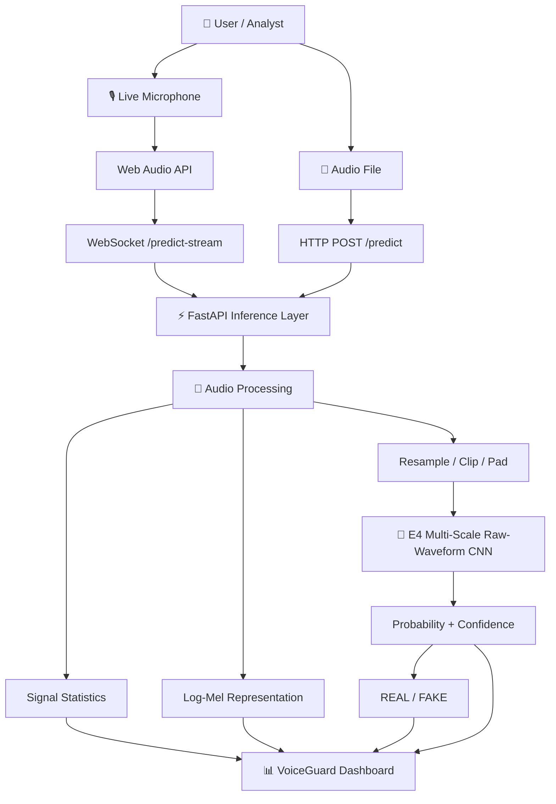
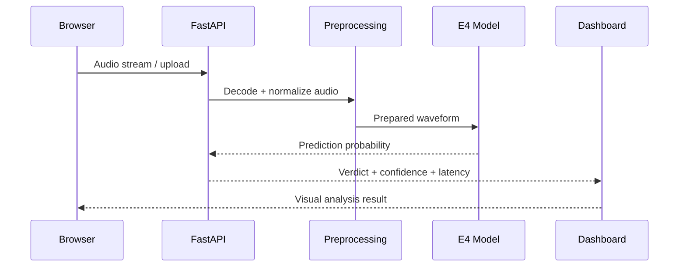
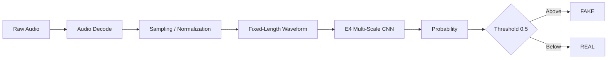
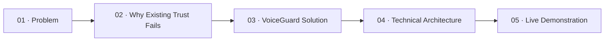

<div align="center">

# 🛡️ VoiceGuard

### **AI-Powered Voice Deepfake Detection & Audio Forensics**

**E4 Multi-Scale Raw-Waveform CNN · Real-Time Detection · Forensic Analysis**

<br/>


<br/>

> **VoiceGuard is an SIH-focused cybersecurity and AI project for detecting synthetic speech and voice deepfakes through real-time and forensic audio analysis.**

<br/>

[Features](#-core-capabilities) · [Architecture](#-system-architecture) · [Model](#-e4-detection-engine) · [Performance](#-evaluation-snapshot) · [Setup](#-quick-start) · [API](#-api-reference)

</div>

---

## 🎯 The Problem

Generative AI has made realistic voice synthesis increasingly accessible. In security-sensitive environments, a convincing synthetic voice can be used to impersonate individuals, manipulate audio evidence, or bypass trust-based communication workflows.

VoiceGuard addresses the detection side of this problem by turning an audio recording or live microphone stream into a model-driven **REAL / FAKE** assessment while exposing additional acoustic information for analysis.

### The goal

```text
              TRUSTED AUDIO COMMUNICATION
                         │
                         ▼
                ┌─────────────────┐
                │    VoiceGuard   │
                │  Audio Analysis │
                └────────┬────────┘
                         │
              ┌──────────┴──────────┐
              ▼                     ▼
        LIVE MICROPHONE         AUDIO FILE
              │                     │
              ▼                     ▼
          WebSocket              REST API
              │                     │
              └──────────┬──────────┘
                         ▼
                 E4 CNN INFERENCE
                         │
              ┌──────────┴──────────┐
              ▼                     ▼
           REAL                  SYNTHETIC
```

---

# ✨ Core Capabilities

<table>
<tr>
<td width="50%">

### 🎙️ Real-Time Detection

- Browser microphone capture
- Web Audio API processing
- WebSocket streaming inference
- Rolling waveform visualization
- Live frequency spectrum
- REAL / FAKE verdict
- Confidence / probability
- Inference latency
- Prediction history

</td>
<td width="50%">

### 🔎 Forensic Analysis

- Audio file upload
- WAV / MP3 workflow
- Interactive WaveSurfer waveform
- Mel-spectrogram visualization
- Spectral statistics
- Model confidence
- Prediction latency
- Audio duration
- Supporting acoustic evidence

</td>
</tr>
<tr>
<td>

### 📊 Model Intelligence

- E4 raw-waveform CNN
- Configurable threshold
- Model health monitoring
- Evaluation metrics
- ROC / AUC data
- Confusion matrix
- Robustness benchmarks

</td>
<td>

### 🧩 Presentation Layer

- Technical architecture section
- Engine comparison
- Performance dashboard
- System status
- Interactive analysis UI
- SIH-ready product presentation

</td>
</tr>
</table>

---

# 🏗️ System Architecture



### Request lifecycle



---

# 🧠 E4 Detection Engine

VoiceGuard's current backend uses the **E4 Multi-Scale Raw-Waveform CNN** as its active detection engine.

The important distinction is that the model consumes raw waveform information in the inference pipeline rather than relying solely on a frontend visualization or a rule-based detector.

### Model pipeline



### Current health contract

A healthy real-model deployment reports:

```json
{
  "status": "healthy",
  "is_mock": false,
  "operating_threshold": 0.5,
  "ensemble_folds": 0,
  "lightweight_loaded": true,
  "engine": "E4 Multi-Scale Raw-Waveform CNN"
}
```

`is_mock: false` is the key indicator that the backend is operating outside its fallback mock path.

---

# 🔬 Acoustic Analysis Layer

VoiceGuard combines neural inference with signal-level analysis so that the dashboard can show more than a single classification label.

| Signal | Purpose |
|---|---|
| **Raw waveform** | Primary representation for E4 inference |
| **Log-Mel spectrogram** | Time-frequency visualization |
| **Spectral centroid** | Center of spectral energy |
| **Spectral bandwidth** | Distribution of spectral energy |
| **Spectral rolloff** | High-frequency energy boundary |
| **Zero-crossing rate** | Temporal sign-change behavior |
| **Spectral flatness** | Tonal vs noise-like characteristics |

These features provide **supporting acoustic context**; they are not independent proof of authenticity.

---

# 📊 Evaluation Snapshot

The repository currently contains evaluation data in `backend/metrics.json`.

### Reported metrics

| Metric | Current value |
|---|---:|
| **Accuracy** | **96.42%** |
| **Precision** | **95.87%** |
| **Recall** | **97.15%** |
| **F1 Score** | **96.51%** |
| **AUC** | **0.9892** |
| **EER** | **3.58%** |
| **Evaluation samples** | **4,850** |

### Robustness benchmark

| Condition | Accuracy |
|---|---:|
| Clean Audio | 98.2% |
| Additive Noise · 10 dB | 94.5% |
| High Noise · 0 dB | 88.7% |
| Telephone Simulation | 91.3% |
| Low-Bitrate MP3 · 32 kbps | 92.8% |
| Short Utterance · 1.0 s | 86.4% |

> **Evaluation note:** These figures are the values currently stored in the repository's metrics configuration. They are evaluation-specific and should be presented together with the underlying dataset, split, protocol, and experimental conditions. They should not be interpreted as universal real-world accuracy.

### Confusion matrix

```text
                 Predicted
              REAL       FAKE
Actual REAL   2380        70
       FAKE    103      2297
```

---

# ⚙️ Technology Stack

<table>
<tr>
<td valign="top" width="33%">

### Frontend

- React 19
- TypeScript
- Tailwind CSS v4
- Vite
- Lucide React
- Recharts
- WaveSurfer.js
- Web Audio API
- Oxlint

</td>
<td valign="top" width="33%">

### Backend

- Python 3.10+
- FastAPI
- Uvicorn
- WebSockets
- NumPy
- SciPy
- librosa
- SoundFile

</td>
<td valign="top" width="33%">

### ML / Audio

- E4 Multi-Scale CNN
- Raw waveform inference
- Audio preprocessing
- Signal statistics
- Log-Mel analysis
- Configurable threshold
- Model manager

</td>
</tr>
</table>

---

# 📂 Repository Structure

```text
VoiceGuard/
│
├── backend/
│   ├── main.py                  # FastAPI app + REST/WebSocket endpoints
│   ├── model_loader.py          # Model loading and inference manager
│   ├── feature_extraction.py    # Audio preprocessing + signal analysis
│   ├── metrics.json             # Evaluation and robustness metrics
│   ├── requirements.txt         # Python dependencies
│   │
│   └── models/
│       └── e4/
│           ├── e4_model.py      # E4 architecture
│           └── best_e4.pt       # Trained E4 checkpoint
│
├── frontend/
│   ├── src/
│   │   ├── App.tsx
│   │   ├── types.ts
│   │   ├── components/
│   │   │   ├── LiveDetector.tsx
│   │   │   ├── ForensicAnalyzer.tsx
│   │   │   └── site/
│   │   │       ├── Hero.tsx
│   │   │       ├── ProblemSection.tsx
│   │   │       ├── AcousticSignals.tsx
│   │   │       ├── ArchitecturePipeline.tsx
│   │   │       ├── EngineComparison.tsx
│   │   │       ├── PerformanceSection.tsx
│   │   │       ├── SystemStatus.tsx
│   │   │       └── TechnicalDetails.tsx
│   │   ├── hooks/
│   │   └── lib/
│   │
│   ├── package.json
│   ├── vite.config.ts
│   └── tsconfig.json
│
├── START_VOICEGUARD.bat         # Windows launcher
├── run_app.bat                  # Application runner
├── CLAUDE.md                    # Development instructions
└── README.md
```

---

# 🚀 Quick Start

## 1. Clone

```bash
git clone https://github.com/Jyatin/VoiceGuard.git
cd VoiceGuard
```

## 2. Start the backend

```powershell
cd backend
python -m venv venv
.\venv\Scripts\activate
pip install -r requirements.txt
uvicorn main:app --reload --port 8000
```

Backend:

```text
http://127.0.0.1:8000
```

API documentation:

```text
http://127.0.0.1:8000/docs
```

## 3. Start the frontend

Open a second terminal:

```powershell
cd frontend
npm install
npm run dev
```

If PowerShell blocks `npm.ps1`:

```powershell
npm.cmd install
npm.cmd run dev
```

---

# 🩺 Verify the Model

Before an SIH demonstration, verify the backend first:

```powershell
curl.exe http://127.0.0.1:8000/health
```

Expected real-model state:

```text
status              = healthy
is_mock             = false
lightweight_loaded  = true
engine              = E4 Multi-Scale Raw-Waveform CNN
```

### Demo checklist

```text
☐ Backend running on port 8000
☐ /health returns healthy
☐ is_mock = false
☐ E4 checkpoint loaded
☐ Frontend connected to backend
☐ Microphone permission granted
☐ Test REAL sample ready
☐ Test SYNTHETIC sample ready
☐ Upload workflow verified
☐ Performance dashboard verified
```

---

# 📡 API Reference

| Method | Endpoint | Purpose |
|---|---|---|
| `GET` | `/` | Service information |
| `GET` | `/health` | Backend + model health |
| `POST` | `/predict` | File-based audio inference |
| `WS` | `/predict-stream` | Real-time streaming inference |
| `GET` | `/metrics` | Evaluation/visualization metrics |

## `POST /predict`

Accepts an uploaded audio file and returns model inference information.

Example:

```json
{
  "label": "REAL",
  "confidence": 0.942,
  "prob_real": 0.942,
  "latency_ms": 38.2,
  "is_mock": false,
  "audio_duration_sec": 3.0
}
```

The endpoint may also return waveform data, Mel-spectrogram information, and extracted acoustic statistics used by the frontend.

## `WS /predict-stream`

The live detector sends audio over WebSocket and receives predictions continuously.

```json
{
  "label": "REAL",
  "prob_real": 0.895,
  "confidence": 0.895,
  "latency_ms": 18.5,
  "is_mock": false,
  "timestamp": 1789042063.68
}
```

---

# 🖥️ Product Experience

### Live Detection Workspace

Designed for a live demonstration: start the microphone, stream speech, watch the waveform and spectrum, and observe the evolving model verdict and confidence.

### Forensic Analyzer

Designed for deeper inspection of an uploaded recording: playback the waveform, inspect the Mel-spectrogram, review signal statistics, and examine the model output.

### Performance Dashboard

Presents the configured evaluation metrics, ROC information, confusion matrix, and robustness conditions in a presentation-friendly format.

### Technical Overview

Explains the pipeline from audio capture to preprocessing, E4 inference, classification, and visualization.

---

# 🏆 Smart India Hackathon — Presentation Context

VoiceGuard is being developed as an **SIH-oriented cybersecurity / AI solution** focused on the detection of AI-generated voice and audio spoofing.

For an SIH presentation, the product story is intentionally structured around five questions:



### Recommended live demo sequence

**1. Establish the problem**  
Explain how synthetic speech can undermine voice-based trust.

**2. Show the architecture**  
Walk through browser → FastAPI → preprocessing → E4 CNN → verdict.

**3. Demonstrate live detection**  
Use the microphone workflow and show the real-time prediction interface.

**4. Demonstrate forensic analysis**  
Upload a sample and show waveform, spectrogram, signal statistics, and inference output.

**5. Show evidence**  
Open the performance dashboard and explain the evaluation protocol behind the displayed metrics.

> **Presentation principle:** demonstrate the system as an evidence-producing analysis tool, not as an infallible oracle.

---

# 🔐 Responsible Use

VoiceGuard is a research and engineering prototype. Audio deepfake detection is an adversarial problem and performance can change with codecs, noise, recording hardware, languages, speakers, unseen synthesis systems, and distribution shift.

A confidence score represents model output, not certainty.

For high-impact applications, predictions should be combined with appropriate human review and additional evidence.

---

# 🧪 Development Notes

### Windows health check

PowerShell aliases `curl` to `Invoke-WebRequest` on many systems. Use:

```powershell
curl.exe http://127.0.0.1:8000/health
```

### Backend model path

```text
backend/models/e4/best_e4.pt
```

### API configuration

Frontend API integration is maintained in:

```text
frontend/src/lib/api.ts
```

### Audio processing

Backend signal processing is maintained in:

```text
backend/feature_extraction.py
```

### Model management

Model discovery and loading are maintained in:

```text
backend/model_loader.py
```

---

# 🛣️ Roadmap

- [x] FastAPI inference service
- [x] E4 model integration
- [x] Real-time WebSocket inference
- [x] Browser microphone capture
- [x] File-based analysis
- [x] Waveform visualization
- [x] Spectrogram visualization
- [x] Acoustic signal statistics
- [x] Evaluation dashboard
- [x] Model health monitoring
- [ ] Expanded multilingual evaluation
- [ ] Larger cross-generator benchmark
- [ ] Production deployment pipeline
- [ ] Model versioning and experiment tracking
- [ ] Explainability research and calibrated uncertainty

---

# 🤝 Contributing

Contributions are welcome for improvements to the frontend, backend, audio-processing pipeline, testing, documentation, and evaluation methodology.

Before opening a change:

1. Verify the backend health endpoint.
2. Test the affected frontend workflow.
3. Avoid committing secrets or local environment files.
4. Document changes that affect the API contract.
5. Include evaluation context when changing model metrics.

---

# 📜 License

No explicit open-source license is currently declared in this repository. If this project is intended for public redistribution, add an appropriate `LICENSE` file.

---

<div align="center">

### 🛡️ VoiceGuard

**Detect the signal. Inspect the evidence. Protect the trust.**

Built for AI security research, audio forensics, and Smart India Hackathon presentation.

</div>
