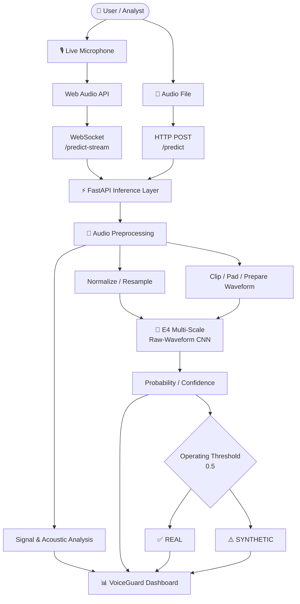
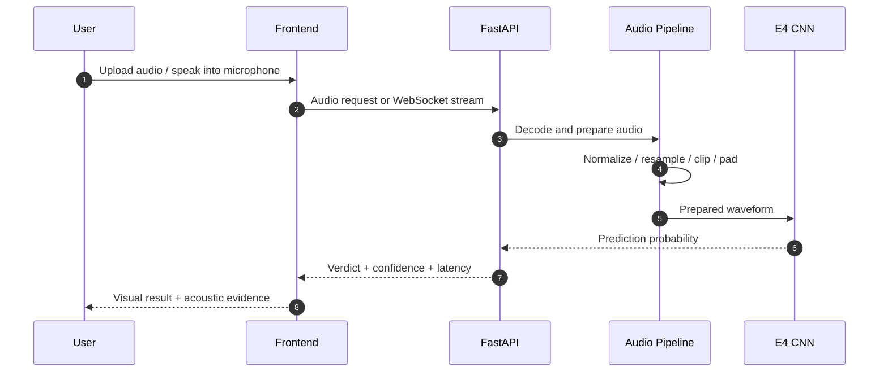
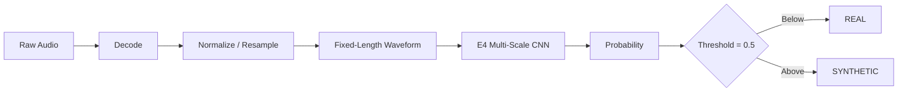
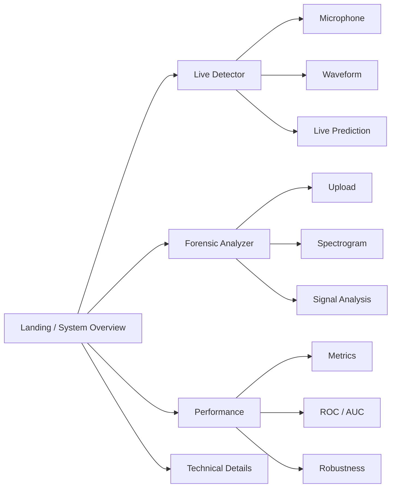
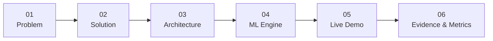

<div align="center">

# 🛡️ VoiceGuard

### **AI-Powered Voice Deepfake Detection & Audio Forensics**

**Detect synthetic speech. Inspect the evidence. Build trust in voice communication.**

<br/>

[](https://www.sih.gov.in/)
[](https://react.dev/)
[](https://www.typescriptlang.org/)
[](https://fastapi.tiangolo.com/)
[](#-e4-detection-engine)

<br/>

**Real-time detection** · **Forensic analysis** · **Raw-waveform deep learning** · **SIH-ready demonstration**

<br/>

[Overview](#-overview) · [Architecture](#-architecture) · [Model](#-e4-detection-engine) · [Performance](#-evaluation-snapshot) · [Setup](#-quick-start) · [API](#-api-reference)

</div>

---

## 🧭 At a Glance

<table>
<tr>
<td width="25%" align="center"><strong>🎙️ LIVE</strong><br/>Microphone detection</td>
<td width="25%" align="center"><strong>🔎 FORENSIC</strong><br/>Audio file analysis</td>
<td width="25%" align="center"><strong>🧠 E4 CNN</strong><br/>Raw-waveform inference</td>
<td width="25%" align="center"><strong>⚡ FASTAPI</strong><br/>Real-time API</td>
</tr>
</table>

> **VoiceGuard** is an AI-based audio security prototype developed for an **SIH-oriented cybersecurity use case**. It analyzes speech recordings and live microphone input to estimate whether audio is authentic or synthetic, while exposing supporting acoustic and model-level evidence.

---

# 🎯 The Problem

Generative AI has lowered the barrier to producing highly convincing synthetic speech. Voice impersonation can affect authentication, fraud prevention, media verification, digital investigations, and trust-based communication.

The challenge is not simply to produce a **REAL / SYNTHETIC** label. A useful detection system should also provide a workflow for **inspection, evidence, latency, confidence, and technical interpretation**.

### VoiceGuard's objective

```text
                 UNTRUSTED AUDIO
                       │
          ┌────────────┴────────────┐
          │                         │
      LIVE VOICE                AUDIO FILE
          │                         │
          └────────────┬────────────┘
                       ▼
              ┌─────────────────┐
              │    VOICEGUARD   │
              │  AUDIO FORENSICS│
              └────────┬────────┘
                       ▼
                E4 CNN INFERENCE
                       │
             ┌─────────┴─────────┐
             ▼                   ▼
           REAL              SYNTHETIC
             │                   │
             └─────────┬─────────┘
                       ▼
            SUPPORTING EVIDENCE
       waveform · spectrum · metrics
```

---

# ✨ What VoiceGuard Does

### 🎙️ Real-Time Voice Detection

- Browser microphone capture
- Web Audio API processing
- WebSocket streaming inference
- Live waveform visualization
- Frequency-spectrum visualization
- Rolling prediction history
- Confidence / probability output
- Inference latency tracking

### 🔬 Forensic Audio Analysis

- Audio file upload workflow
- Waveform inspection
- Audio playback
- Log-Mel spectrogram visualization
- Spectral statistics
- Duration and signal information
- Model prediction and confidence
- Supporting analysis for human review

### 📊 Model & System Intelligence

- E4 Multi-Scale Raw-Waveform CNN
- Configurable operating threshold
- Model health endpoint
- Evaluation metrics
- ROC / AUC information
- Confusion matrix
- Robustness benchmarks
- Mock-vs-real inference status

---

# 🏗️ Architecture



### 🔄 End-to-End Inference Flow



---

# 🧠 E4 Detection Engine

The active VoiceGuard backend uses the **E4 Multi-Scale Raw-Waveform CNN**.

The inference pipeline is designed around waveform-level information rather than treating a spectrogram displayed by the UI as the detector itself.



### Current backend health state

The deployed local backend has been verified with a successful health response indicating:

```json
{
  "status": "healthy",
  "is_mock": false,
  "operating_threshold": 0.5,
  "ensemble_folds": 0,
  "lightweight_loaded": true,
  "engine": "E4 Multi-Scale Raw-Waveform CNN"
}
```

**`is_mock: false`** indicates that the backend is not operating in its mock inference path.

---

# 🔬 Supporting Acoustic Analysis

VoiceGuard exposes signal-level information alongside neural inference to make the result more inspectable.

| Analysis | What it provides |
|---|---|
| **Raw waveform** | Time-domain representation used by the E4 inference path |
| **Log-Mel spectrogram** | Time-frequency view of the recording |
| **Spectral centroid** | Location of spectral energy concentration |
| **Spectral bandwidth** | Spread of spectral energy |
| **Spectral rolloff** | Frequency boundary containing most spectral energy |
| **Zero-crossing rate** | Temporal sign-change behavior |
| **Spectral flatness** | Tonal vs noise-like characteristics |

> These measurements are **supporting evidence**, not standalone proof that an audio recording is genuine or synthetic.

---

# 📈 Evaluation Snapshot

The repository contains the current evaluation configuration in `backend/metrics.json`.

| Metric | Value |
|:---|---:|
| **Accuracy** | **96.42%** |
| **Precision** | **95.87%** |
| **Recall** | **97.15%** |
| **F1 Score** | **96.51%** |
| **AUC** | **0.9892** |
| **EER** | **3.58%** |
| **Evaluation samples** | **4,850** |

### Robustness snapshot

| Test condition | Accuracy |
|:---|---:|
| Clean Audio | 98.2% |
| Additive Noise · 10 dB | 94.5% |
| High Noise · 0 dB | 88.7% |
| Telephone Simulation | 91.3% |
| Low-Bitrate MP3 · 32 kbps | 92.8% |
| Short Utterance · 1.0 s | 86.4% |

### Confusion Matrix

```text
                         PREDICTED
                    ┌───────────┬───────────┐
                    │   REAL    │ SYNTHETIC │
        ┌───────────┼───────────┼───────────┤
 ACTUAL │   REAL    │   2380    │     70    │
        ├───────────┼───────────┼───────────┤
        │ SYNTHETIC │    103    │   2297    │
        └───────────┴───────────┴───────────┘
```

> **Evaluation note:** These values are the metrics currently stored in the repository. They should be interpreted in the context of the dataset, split strategy, synthesis systems, preprocessing pipeline, and evaluation protocol used to produce them. They are not a guarantee of universal real-world performance.

---

# 🖥️ Product Experience



### Live Detector

A demonstration-oriented workspace for microphone input, streaming inference, waveform/spectrum visualization, confidence, and prediction history.

### Forensic Analyzer

A deeper analysis workflow for uploaded recordings, combining playback, waveform inspection, spectrogram visualization, acoustic statistics, and model output.

### Performance & Technical Views

Presentation-friendly views for communicating model performance, system architecture, signal analysis, and deployment status.

---

# ⚙️ Technology Stack

| Layer | Technologies |
|:---|:---|
| **Frontend** | React 19 · TypeScript · Vite · Tailwind CSS · Lucide React · Recharts · WaveSurfer.js |
| **Browser Audio** | Web Audio API · Microphone Media APIs |
| **Backend** | Python · FastAPI · Uvicorn · WebSockets |
| **Audio / DSP** | NumPy · SciPy · librosa · SoundFile |
| **ML** | PyTorch / E4 Multi-Scale Raw-Waveform CNN |
| **API** | REST · WebSocket |
| **Developer Tooling** | npm · Git · GitHub |

---

# 📂 Repository Structure

```text
VoiceGuard/
│
├── backend/
│   ├── main.py
│   ├── model_loader.py
│   ├── feature_extraction.py
│   ├── metrics.json
│   ├── requirements.txt
│   │
│   └── models/
│       └── e4/
│           ├── e4_model.py
│           └── best_e4.pt
│
├── frontend/
│   ├── src/
│   │   ├── App.tsx
│   │   ├── types.ts
│   │   ├── components/
│   │   │   ├── LiveDetector.tsx
│   │   │   ├── ForensicAnalyzer.tsx
│   │   │   └── site/
│   │   │       ├── Hero.tsx
│   │   │       ├── ProblemSection.tsx
│   │   │       ├── AcousticSignals.tsx
│   │   │       ├── ArchitecturePipeline.tsx
│   │   │       ├── EngineComparison.tsx
│   │   │       ├── PerformanceSection.tsx
│   │   │       ├── SystemStatus.tsx
│   │   │       └── TechnicalDetails.tsx
│   │   ├── hooks/
│   │   └── lib/
│   ├── package.json
│   ├── vite.config.ts
│   └── tsconfig.json
│
├── START_VOICEGUARD.bat
├── run_app.bat
├── CLAUDE.md
└── README.md
```

---

# 🚀 Quick Start

## 1. Clone the repository

```bash
git clone https://github.com/Jyatin/VoiceGuard.git
cd VoiceGuard
```

## 2. Create the backend environment

```powershell
cd backend
python -m venv venv
.\venv\Scripts\activate
pip install -r requirements.txt
```

## 3. Start FastAPI

```powershell
uvicorn main:app --reload --port 8000
```

Backend:

```text
http://127.0.0.1:8000
```

Interactive API docs:

```text
http://127.0.0.1:8000/docs
```

## 4. Start the frontend

Open a second terminal:

```powershell
cd frontend
npm install
npm run dev
```

If PowerShell blocks the npm script:

```powershell
npm.cmd install
npm.cmd run dev
```

---

# 🩺 Verify Before a Demo

Run:

```powershell
curl.exe http://127.0.0.1:8000/health
```

A real-model deployment should report a healthy state with:

```text
status             : healthy
is_mock            : false
lightweight_loaded : true
engine             : E4 Multi-Scale Raw-Waveform CNN
```

### SIH Demo Readiness Checklist

- [ ] Backend starts successfully
- [ ] `/health` returns `healthy`
- [ ] `is_mock` is `false`
- [ ] E4 model checkpoint loads successfully
- [ ] Frontend starts successfully
- [ ] Browser microphone permission is granted
- [ ] Known REAL sample is ready
- [ ] Known SYNTHETIC sample is ready
- [ ] File upload workflow works
- [ ] Live streaming workflow works
- [ ] Performance section is ready to present
- [ ] Network / backend URLs are configured correctly

---

# 📡 API Reference

| Method | Endpoint | Purpose |
|:---:|:---|:---|
| `GET` | `/` | Service information |
| `GET` | `/health` | Backend and model health |
| `POST` | `/predict` | File-based audio inference |
| `WS` | `/predict-stream` | Real-time streaming inference |
| `GET` | `/metrics` | Evaluation and visualization metrics |

### `POST /predict`

Accepts an audio file and returns model inference information. A representative response can contain:

```json
{
  "label": "REAL",
  "confidence": 0.942,
  "prob_real": 0.942,
  "latency_ms": 38.2,
  "is_mock": false,
  "audio_duration_sec": 3.0
}
```

### `WS /predict-stream`

The live detector sends audio chunks over WebSocket and receives prediction updates.

```json
{
  "label": "REAL",
  "prob_real": 0.895,
  "confidence": 0.895,
  "latency_ms": 18.5,
  "is_mock": false,
  "timestamp": 1789042063.68
}
```

> Response fields can evolve with the backend implementation. Use `/docs` and the source code as the authoritative API contract.

---

# 🏆 Smart India Hackathon — Demo Story

VoiceGuard is structured to make the technical story easy to communicate during an **SIH presentation**.



### Recommended 5-minute walkthrough

**01 — Problem**  
Explain the security risk created by increasingly accessible voice synthesis.

**02 — Solution**  
Introduce VoiceGuard as an analysis pipeline rather than a simple binary classifier.

**03 — Architecture**  
Show browser → FastAPI → audio preprocessing → E4 CNN → result.

**04 — Live Detection**  
Speak into the microphone and demonstrate streaming inference.

**05 — Forensic Analysis**  
Upload a prepared recording and inspect waveform, spectrogram, acoustic information, and prediction.

**06 — Evidence**  
Finish with the evaluation dashboard, robustness results, limitations, and future deployment direction.

---

# 🔐 Responsible Use & Limitations

VoiceGuard is a research / engineering prototype for audio deepfake analysis. Detection performance can vary with:

- unseen voice-generation systems
- codecs and compression
- background noise
- microphones and recording environments
- speaker characteristics
- language and accent distribution
- very short recordings
- adversarial manipulation
- distribution shift between training and deployment data

A model confidence score is **not proof of authenticity**. High-impact decisions should incorporate human review and additional evidence.

---

# 🗺️ Roadmap

### Current

- [x] E4 raw-waveform inference engine
- [x] FastAPI inference service
- [x] Real-time WebSocket detection
- [x] Audio upload analysis
- [x] Waveform / spectrum visualization
- [x] Acoustic analysis layer
- [x] Performance dashboard
- [x] Model health monitoring

### Next

- [ ] Expanded multilingual evaluation
- [ ] Larger cross-generator benchmark
- [ ] Better calibration of confidence scores
- [ ] Explainability / attribution views
- [ ] Model versioning and experiment tracking
- [ ] Containerized deployment
- [ ] Production-grade authentication and access control
- [ ] Continuous evaluation against emerging synthesis models

---

# 🤝 Contributing

Contributions, experiments, bug reports, and research improvements are welcome.

```bash
git checkout -b feature/your-feature
git add .
git commit -m "feat: describe your change"
git push origin feature/your-feature
```

Then open a pull request with:

- problem statement
- implementation summary
- screenshots / benchmark results where relevant
- testing performed
- known limitations

---

# 📚 Project Focus

VoiceGuard brings together **AI/ML, audio signal processing, cybersecurity, real-time systems, and modern web engineering** into one demonstrable platform.

```text
                 ┌───────────────────────────┐
                 │        VOICEGUARD          │
                 └─────────────┬─────────────┘
                               │
       ┌───────────────────────┼───────────────────────┐
       │                       │                       │
       ▼                       ▼                       ▼
   AI / ML                AUDIO DSP             CYBERSECURITY
       │                       │                       │
       └───────────────────────┼───────────────────────┘
                               │
                               ▼
                    REAL-TIME WEB PLATFORM
```

---

<div align="center">

### 🛡️ VoiceGuard

**AI-powered voice deepfake detection & audio forensics**

Built for experimentation, demonstration, and continued research in trustworthy audio intelligence.

<br/>

**Smart India Hackathon 2026 · Voice Security · AI / ML · Audio Forensics**

</div>
